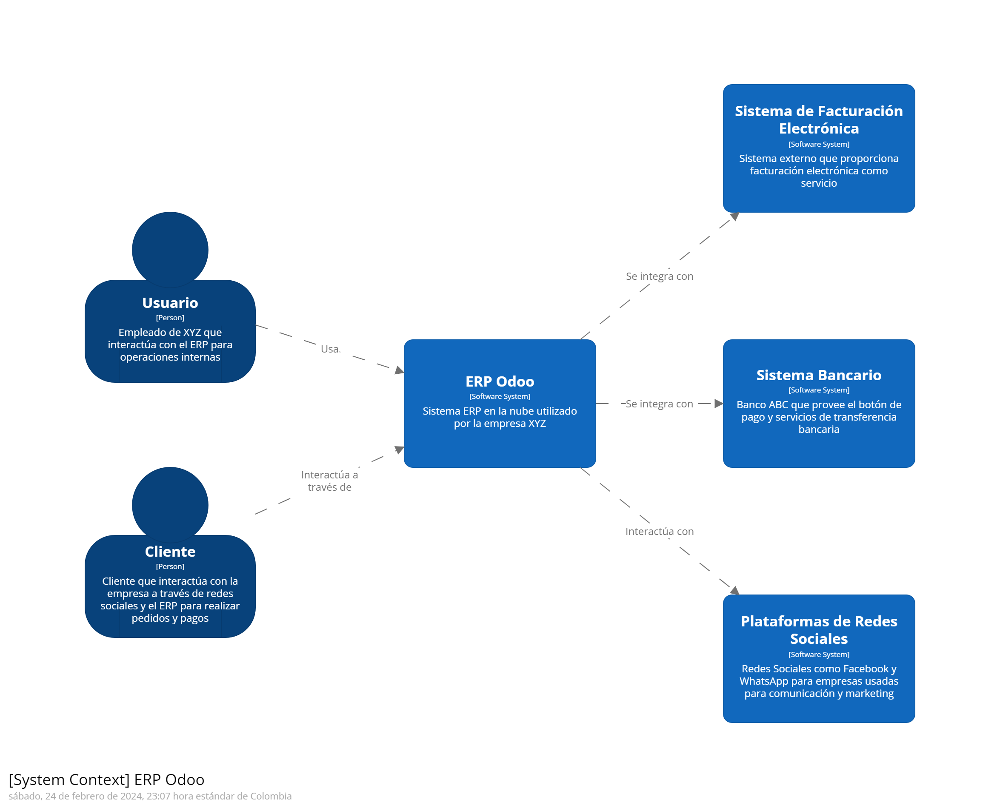
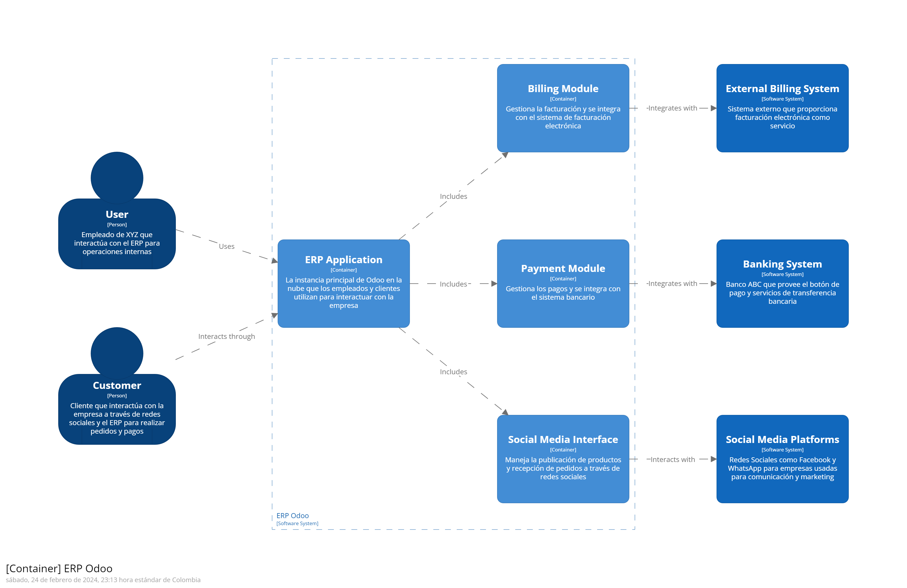
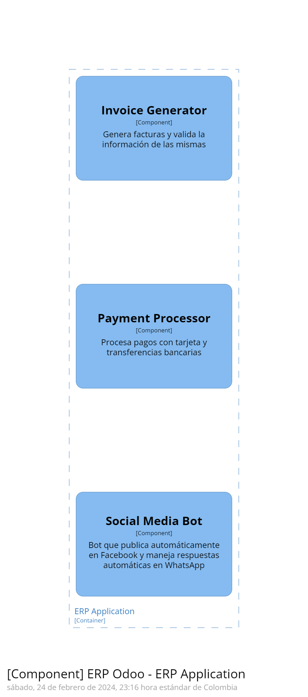

# Menú de Contenido
- [Solución de Integración de Aplicaciones](#solución-de-integración-de-aplicaciones)
  - [Tipos de Integración que se Puede Realizar entre los Sistemas y Plataformas](#tipos-de-integración-que-se-puede-realizar-entre-los-sistemas-y-plataformas)
  - [Documente sus Decisiones Utilizando el Formato ADR](#documente-sus-decisiones-utilizando-el-formato-adr)
    - [Plantilla de Registro de Decisiones de Michael Nygard](#plantilla-de-registro-de-decisiones-de-michael-nygard)
        - [ADR1](#adr1)
        - [ADR2](#adr2)
        - [ADR2](#adr3)
  - [Diagrama Utilizando el Modelo C4](#diagrama-utilizando-el-modelo-c4)
    - [System Context ERP Odoo](#system-context-erp-odoo)
    - [Container ERP Odoo](#container-erp-odoo)
    - [Component ERP Odoo](#component-erp-odoo)
    
- [Anexo](#anexo)

## Solución de Integración de Aplicaciones
La empresa XYZ ha implementado hace más de tres años una solución de ERP opensource Odoo, la cual la ha utilizado inicialmente on-premise, han tenido un crecimiento constante, paso de tener una oficina a tener 20 oficinas en todo el país, además de abrir presencia en plataformas para masificar sus productos y atraer a más clientes utilizando Facebook y WhatsApp para empresas, en donde de igual manera ha tenido una gran acogida; se empezaron a presentar problemas relacionado a la versión que tiene la empresa por lo que ha optado con migrar a la versión comercial en la nube del fabricante de Odoo, reduciendo los problemas de lentitud e intermitencia que tenían entre las diferentes oficinas, pero sin resolver los siguientes problemas:
- Facturación electrónica, provista por un proveedor local que dispone de una plataforma web, el proveedor ofrece su plataforma en la modalidad plataforma como servicio.
- Medios de pago, la empresa necesita recibir pagos por medio de transferencias bancarias, además con la finalidad de reducir los tiempos de respuesta en procesar pagos y despachar las ordenes de compra, la empresa XYZ logró conseguir que la institución financiera ABC le provee el botón de pagos para recibir pagos con tarjetas de débito y crédito, el botón de pagos tiene dos métodos para que la empresa XYZ pueda utilizarlo, ofrece una API y un plugin listo para usar en Odoo.
- Manejo de redes sociales, la empresa necesita una solución que le permita poder publicar productos y recibir pedidos por redes sociales, ya que actualmente utilizan Facebook y WhatsApp para empresas, que le permiten presentar sus productos y contactarse con los clientes para tomar sus pedidos, ya que actualmente si la empresa ofrece un nuevo producto una persona encargada de las redes realiza la publicación manual en la página de Facebook, si un cliente se contacta por medio de WhatsApp, de igual manera si la persona que maneja el dispositivo móvil con la cuenta empresarial revisa podrá ver que alguien escribió solicitando algún producto  o información, pero los clientes escriben no solo en horario laboral por lo que se necesita dar una respuesta a estos clientes.
[Volver al menú](#menú-de-contenido)

## Tipos de Integración que se Puede Realizar entre los Sistemas y Plataformas

- Integración del sistema opensource Odoo con la plataforma de facturación electrónica:
  - Tipo de integración: API a API
- Integración del sistema opensource Odoo con el botón de pagos:
  - Tipo de integración: API a API
  - Tipo de integración: Plugin
- Integración del sistema opensource Odoo con las redes sociales:
  - Tipo de integración: Webhook
[Volver al menú](#menú-de-contenido)

## Documente sus Decisiones Utilizando el Formato ADR
#### Plantilla de Registro de Decisiones de Michael Nygard
#### ADR1
#### ADR 1: Integración de la plataforma de facturación electrónica con el Sistema ERP Odoo

- **Título:** Integración de Odoo con la plataforma de facturación electrónica
- **Estado:** Aceptado

#### Contexto

La empresa necesita una solución para facturar electrónicamente sus productos y servicios. La plataforma de facturación electrónica ofrece una API que puede ser utilizada para enviar los datos de las facturas.

#### Decisión

Se utilizará el servicio de la plataforma de facturación electrónica para enviar los datos de las facturas desde Odoo por medio de una API. La plataforma de facturación electrónica devolverá un confirmado de recibo y un número de factura electrónica.

#### Consecuencias

#### Pros:

- Se automatizará el proceso de facturación electrónica.
- Se reducirá el tiempo y el esfuerzo manual necesarios para facturar electrónicamente.
- Se mejorará la precisión de las facturas electrónicas.

#### Contras:

- Se requiere un desarrollo adicional para integrar Odoo con la plataforma de facturación electrónica.
- Se incurrirá en un costo adicional por la suscripción a la plataforma de facturación electrónica.

[Regresar al menú](#menú-de-contenido)
#### ADR2
#### ADR2: Integración de Odoo con el botón de pagos

- **Título:** Integración de Odoo con el botón de pagos
- **Estado:** Aceptado

#### Contexto

La empresa necesita una solución para recibir pagos de sus clientes en línea. El botón de pagos ofrece una API que puede ser utilizada para recibir pagos con tarjetas de débito y crédito.

#### Decisión

Se utilizará la API del botón de pagos para recibir los pagos de los clientes. El botón de pagos devolverá un token de autorización que se utilizará para confirmar el pago en Odoo.

#### Consecuencias

#### Pros:

- Se automatizará el proceso de recepción de pagos.
- Se reducirá el tiempo y el esfuerzo manual necesarios para recibir pagos.
- Se mejorará la seguridad de los pagos.

#### Contras:

- Se requiere un desarrollo adicional para integrar Odoo con el botón de pagos.
- Se incurrirá en un costo adicional por la suscripción al botón de pagos.

[Regresar al menú](#menú-de-contenido)

#### ADR3
#### ADR3: Integración de Odoo con las redes sociales

- **Título:** Integración de Odoo con las redes sociales
- **Estado:** Aceptado

#### Contexto

La empresa XYZ necesita una solución para gestionar sus redes sociales y recibir pedidos de los clientes a través de ellas. Las redes sociales ofrecen APIs y webhooks que pueden ser utilizados para automatizar la gestión de las redes sociales.

#### Decisión

Se utilizará un webhook para recibir notificaciones de las publicaciones en las redes sociales. Odoo procesará las notificaciones y creará automáticamente pedidos o leads.

#### Consecuencias

#### Pros:

- Se automatizará la gestión de las redes sociales.
- Se reducirá el tiempo y el esfuerzo manual necesarios para gestionar las redes sociales.
- Se mejorará la atención al cliente.

#### Contras:

- Se requiere un desarrollo adicional para integrar Odoo con las redes sociales.
- Se puede incurrir en un costo adicional por la suscripción a las APIs de las redes sociales.

[Regresar al menú](#menú-de-contenido)

## Diagrama Utilizando el Modelo C4
#### [System Context] ERP Odoo
Diagrama del contexto del sistema para ERP Odoo.

#### [Container] ERP Odoo
Diagrama de contenedor para ERP Odoo.

#### [Component] ERP Odoo
Diagrama de componete para ERP Odoo.

## Anexo
Información adicional o complementaria.
